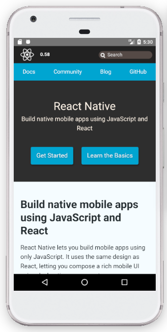

# react-native-webapp

### Dependencies
- React Native Webview: **[Link](https://github.com/react-native-community/react-native-webview/)**
- Native Base: **[Link](http://nativebase.io/)**
- React Native Splash Screen **[Link](https://github.com/crazycodeboy/react-native-splash-screen)**

### Examples
#### Splash Screen


#### With Header & Logo


#### Without Header


### Config file
``` javascript
config = {
  header: {
    visible: false, // false: hider the heade NavBar
    hasLogo: true, // false: hide logo
    logoMarginLeft: 0,
    logoMarginRight: 16,
    logoHeight: 24,
    logoWidth: 24,
    title: "RN WebApp",
    titleColor: "#000",
    backgroundColor: "#f70",
    paddingLeft: 16
  },
  spinner: {
    showSpinner: true, // false: hide the spinner on loading the page
    color: "#f00", // Spinner color
    size: "large", // small OR large
    positionRight: 10,
    positionBottom: 10,
  },
  web: {
    url: "https://github.com/",
    marginTop: 0,
    automaticallyAdjustContentInsets: true,  // Set this to provide JavaScript that will be injected into the web page when the view loads. Make sure the string evaluates to a valid type (true works) and doesn't otherwise throw an exception.
    cacheEnabled: true, // Sets whether WebView & WKWebView should use browser caching.
    scalesPageToFit: true // Boolean that controls whether the web content is scaled to fit the view and enables the user to change the scale.
  }
}
```
